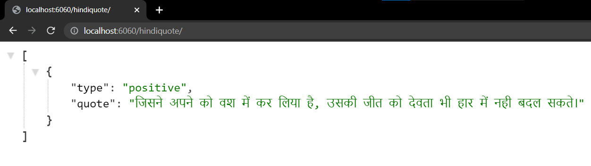

# REST API - Hindi Quotes

An API which display random हिन्दी Quotes.

## Method

- GET

## URL params

 - /success
 - /love
 - /attitude
 - /positive
 - /motivational

## Success response

An array with JSON object

### Without parameter

### With parameter

## Error response 
Empty array

