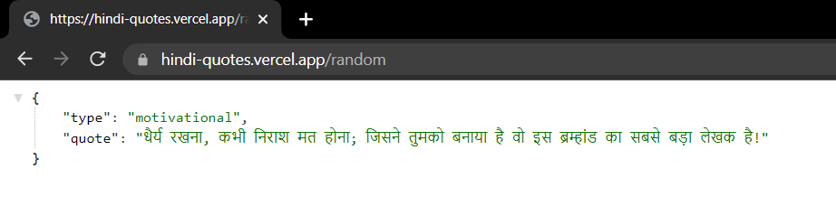
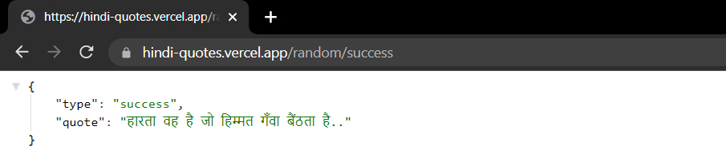
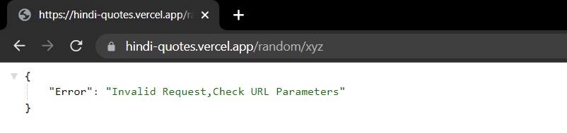

# REST API - Hindi Quotes

An API which display random हिन्दी Quotes.

## API 
 ```html
    https://hindi-quotes.vercel.app/random
 ```

## Method

- GET

## URL params

 - /success
 - /love
 - /attitude
 - /positive
 - /motivational

## Success response

An array with JSON object

### Without parameter


### With parameter




## Error response 
JSON Object with Error Object and Status 400(Invalid Request)



## Contribution
- Read [CONTRIBUTION.md](./CONTRIBUTION.md) for guidelines.

## To-Do

- [x] Reduce Time delay in fetching a quote from the Database
- [x] Handle Errors with better response
- [ ] Add more types of quote